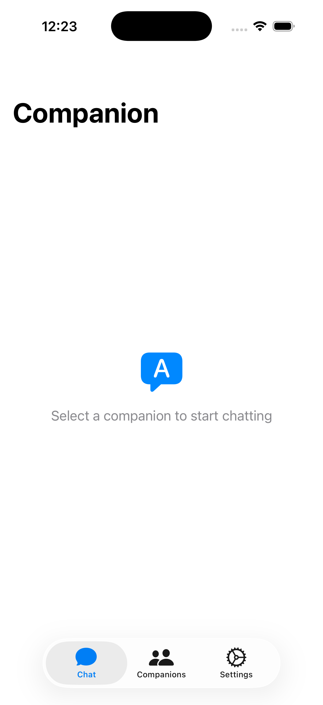
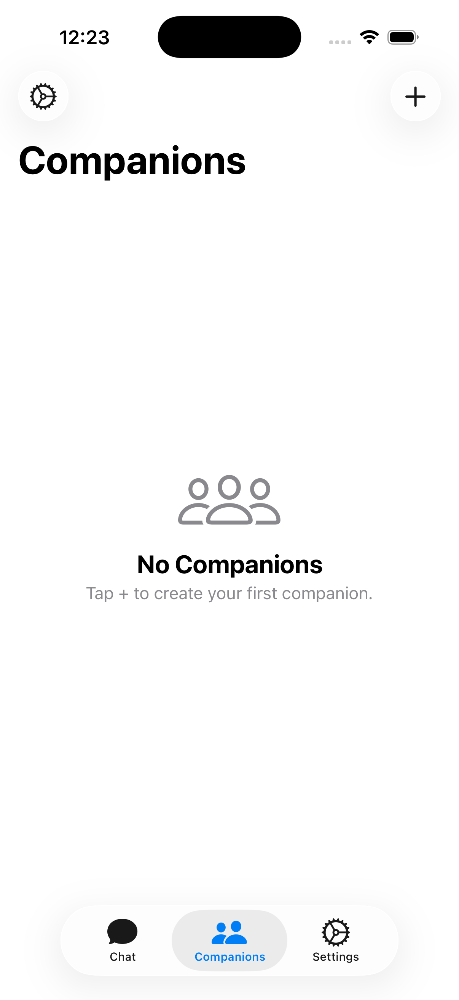
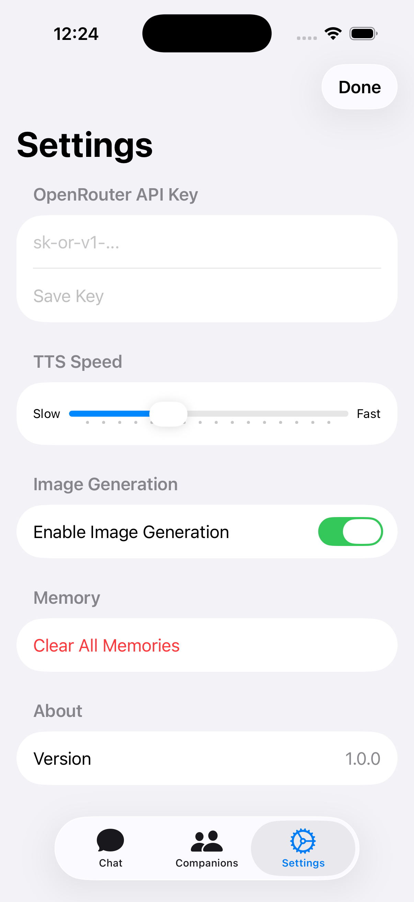

# Compy — AI Companion

**On-device iOS app** for interactive AI companions. Everything runs on your iPhone — the only external dependency is OpenRouter (bring your own API key). Each companion has an LLM-driven personality, a 3D parametric avatar rendered in SceneKit/RealityKit, voice interaction via AVFoundation, and persistent long-term memory in an embedded SQLite graph (GRDB.swift).

<div align="center">
  
  
  
</div>

## Features

| Feature | Status | Details |
|---------|--------|---------|
| **Companion creation** | ✅ | Name, traits, appearance attributes |
| **Chat** | ✅ | SSE streaming, memory-injected context |
| **Memory Graph** | ✅ | SQLite via GRDB.swift — facts, preferences, events, emotions |
| **Memory Extraction** | ✅ | Post-turn LLM call extracts structured memories |
| **Relationship Stages** | ✅ | acquaintance → friend → confidant (counter-based) |
| **Persona Assembly** | ✅ | Pure function, unit-tested |
| **Dynamic Model Catalog** | ✅ | Live fetch from OpenRouter, TTL cache, fallback |
| **Model Selection** | ✅ | Cost-first policy: free → cheapest paid, quality floor |
| **Fallback Rotation** | ✅ | 429/5xx → auto-retry next candidate |
| **3D Parametric Avatar** | ✅ | SceneKit, morph targets, material swaps |
| **Lip Sync** | ✅ | PCM-sample-driven viseme timing |
| **Facial Expressions** | ✅ | Blend-shape presets |
| **TTS** | ✅ | AVSpeechSynthesizer, per-companion voice/pitch/rate |
| **STT** | 🚧 | Apple Speech framework scaffolded |
| **Identity-Reference Image** | 🚧 | Phase 3.5 (gated) |
| **Settings** | ✅ | BYOK key entry, connection test, model override |
| **Network Monitor** | ✅ | Connectivity-aware UI states |
| **Test Coverage** | 59 tests | 5 suites across avatar, audio, persona, selection, catalog |

## Architecture

```
┌─────────────────────────────────────────────────────────┐
│                     SwiftUI Layer                        │
│  ChatView · AvatarView · SettingsView · CompanionsView   │
└──────────────────────┬──────────────────────────────────┘
                       │ MVVM
┌──────────────────────▼──────────────────────────────────┐
│                   ViewModels                             │
│  ChatViewModel · AvatarViewModel · SettingsViewModel ·   │
│  CompanionsViewModel                                     │
└──────┬──────────────────────┬───────────────────────────┘
       │                      │
┌──────▼──────────┐  ┌───────▼──────────────────────────┐
│  Avatar          │  │  Core                             │
│  SceneKit        │  │  ┌──────────┐ ┌───────────────┐  │
│  Morph Targets   │  │  │ LLM      │ │ Memory (GRDB) │  │
│  Expressions     │  │  │ Client   │ │ Graph Store   │  │
│  Lip Sync        │  │  │ Catalog  │ │ Retrieval     │  │
└─────────────────┘  │  │Selection │ │ Queries       │  │
                      │  └──────────┘ └───────────────┘  │
┌─────────────────┐  │  ┌──────────┐ ┌───────────────┐  │
│  Voice           │  │  │Persona   │ │ Storage       │  │
│  AVSpeechSynth   │  │  │Assembly  │ │ Keychain      │  │
│  STT (Apple)     │  │  │Prompts   │ │ File Cache    │  │
└─────────────────┘  │  └──────────┘ └───────────────┘  │
                      └──────────────────────────────────┘
                                      │
                          ┌───────────▼───────────┐
                          │  OpenRouter (BYOK)     │
                          │  GET /models           │
                          │  POST /chat/completions│
                          │  POST /images (opt)    │
                          └───────────────────────┘
```

### Key Design Decisions

- **All on-device.** No backend server. Only OpenRouter calls leave the device.
- **Dynamic model selection.** Models are resolved at runtime from the live OpenRouter catalog using a cost-first policy — never hardcoded. If a model is rate-limited or removed mid-session, fallback rotation keeps the chat working.
- **Memory is the product.** Before every LLM call, the graph is queried for salient memories (by salience + recency) and injected into the context. This creates companions that remember across sessions.
- **Appearance is structured.** Stored as attribute rows in the graph — never as raw images. Images/meshes are derived artifacts cached by attribute hash.
- **Secrets stay secret.** API key lives in the iOS Keychain, entered in-app. No `.env`, no plists.

## Tech Stack

| Layer | Technology |
|-------|-----------|
| Language | Swift 5.9+ |
| UI | SwiftUI + MVVM |
| Avatar | SceneKit (SCNSceneRenderer, SCNMorpher) |
| Graph DB | SQLite via GRDB.swift |
| LLM Provider | OpenRouter (OpenAI-compatible SSE API) |
| TTS | AVSpeechSynthesizer |
| STT | Apple Speech framework |
| Secrets | iOS Keychain |
| Caching | NSCache + file system |
| Build | XcodeGen (project.yml) |
| Min Target | iOS 17 |

## Getting Started

### Prerequisites

- Xcode 15+
- [XcodeGen](https://github.com/yonaskolb/XcodeGen) (for regenerating the Xcode project)
- An [OpenRouter](https://openrouter.ai) API key

### Setup

```bash
# 1. Clone the repo
git clone https://github.com/AnubisRooster/CompyPal.git
cd CompyPal

# 2. Regenerate the Xcode project (if needed after project.yml changes)
cd ios && xcodegen generate && cd ..

# 3. Open in Xcode
open ios/Companion.xcodeproj

# 4. Select an iOS 17 simulator or device, then Build & Run (⌘R)

# 5. On first launch, enter your OpenRouter API key in Settings
```

### Development Commands

```bash
# Regenerate project after changing project.yml
cd ios && xcodegen generate

# Build from command line
cd ios && xcodebuild -scheme Companion -destination 'platform=iOS Simulator,name=iPhone 17' build

# Run tests
cd ios && xcodebuild test -scheme Companion -destination 'platform=iOS Simulator,name=iPhone 17'
```

## Build Phases

The project follows a phased build plan defined in `docs/SPEC.md`:

| Phase | Status | Description |
|-------|--------|-------------|
| **0 — Scaffold & Catalog** | ✅ Complete | Keychain, catalog fetch/cache, selection policy, test connection |
| **1 — Text Companion** | ✅ Complete | Chat, memory extraction/injection, persona assembly, relationship stages |
| **2 — Voice & Avatar** | ✅ Mostly Complete | 3D avatar, lip sync, expressions, TTS, STT scaffolded |
| **3 — Appearance Mutation** | 🚧 Next | In-chat appearance changes via structured deltas |
| **3.5 — Identity-Reference Image** | 🔜 Planned | Optional reference image generation (gated) |
| **4 — Polish** | 🔜 Planned | Latency optimization, offline states, accessibility |

## Code Conventions

- SwiftUI + MVVM: one `ObservableObject` view model per feature.
- All LLM traffic through `Core/LLM/Client/OpenRouterClient` actor. No ad-hoc `URLSession` in views.
- All graph access through `Core/Memory/` — no raw SQL elsewhere.
- Everything `Codable`. No force-unwraps in production paths.
- Cache meshes/textures/audio/catalog via `NSCache` + disk, keyed by content hash / role.
- Catalog parsing and selection policy are pure and unit-tested; no network code inside the policy.
